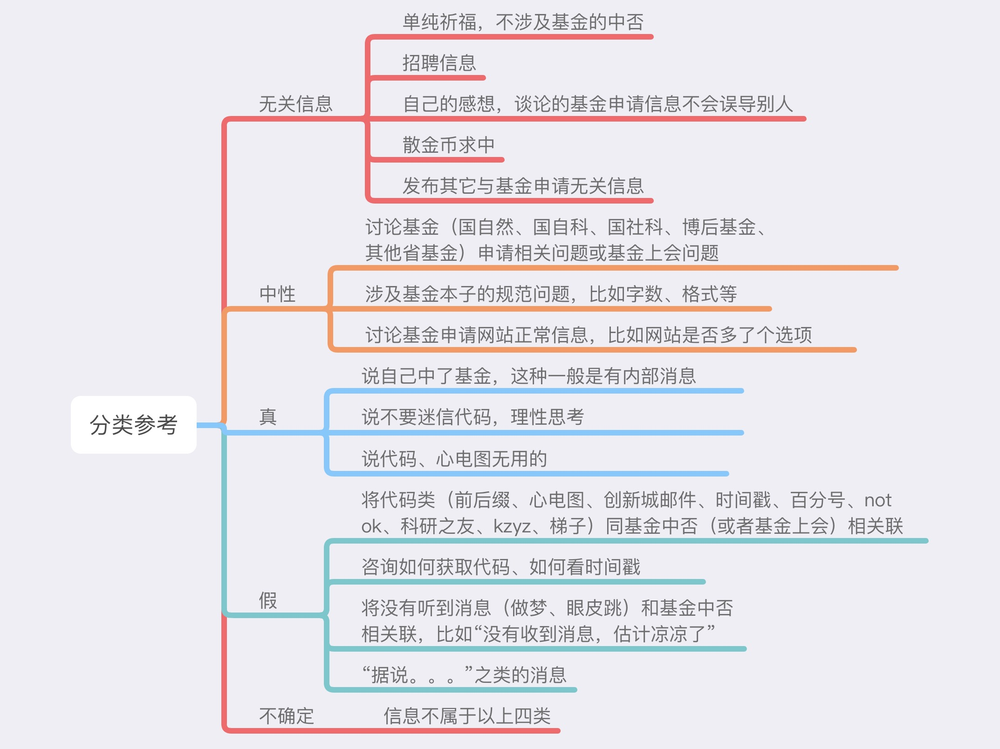

- [snowflake]([Worksheet (snowflakecomputing.com)](https://zr93224.ca-central-1.aws.snowflakecomputing.com/console#/internal/worksheet))

  - holmes928

  

- 涉及三无
  - 6 三无人员祈福 。我肯定是三无，不过三无是哪三无？
- 涉及几次申请基金、未中再战等
  - 为明天会评祈福。。。 。三战了，万能的神能感受到我的虔诚吧。。。 基金申请 社科基金"
  - 541.基金未中，散金 。完全转行，基金3战未中，散金一波。不忘初心，按部就班做实验，我们明年再战！ 基金申请 自然科学基金申报"
- 涉及梯子、漏洞、系统维护、申报系统的确认
  - 525.今天基金委信息系统是在维护吗？ 。登录系统时总显示维护，退出重新登录才正常。大家都是这样吗？ 基金申请 博后基金"
  - 551.是系统漏洞吗？ 。自己和同事都是自科结题无在研，都报了今年的面上，但是自己的系统登录角色选择只有“负责人”和“评审专家”，同事的有“申请人”、“负责人”和“评审专家”。 基金申请 自然科学基金申报"
  - 558.请问这个申请项目参与确认选项卡一直都存在吗？
- 涉及邮件
  - 578.有没有人收到“关于受理2021年度国家自然科学基金依托单位注册申请的通告”邮件通知 。

- 涉及关于基金申请的消极的情绪
  - 521.此生再无青基 吾辈何去何从 。男博士三次申请全部告负此生再无青基身在高校深感前途渺茫无金无财无未来感觉三十年读书终究是错付了有没有同命运的虫友你会计划放弃另谋新职还是继续坚持下去大家有何想法或建议欢迎分享 基金申请 自然科学基金申报"
  - 570.强烈感觉基金已凉 。一年又一年，何时才是头，没意思 基金申请 自然科学基金申报"
- 关于做梦、将意外与基金中否关联
  - 557.昨晚做梦用刀切挂面，是不是面上基金挂了？ 。不是吃也不是做，居然梦到用刀切挂面，啥意思啊？ 基金申请 自然科学基金申报"
  - 565.额……… 。早上崽崽在我的看护下从床上掉下去，额头上肿了一个大青包，一直深深地自责中。…………下午就得知青基挂了！！！ 基金申请 其他"

- 关于是否该换职业

